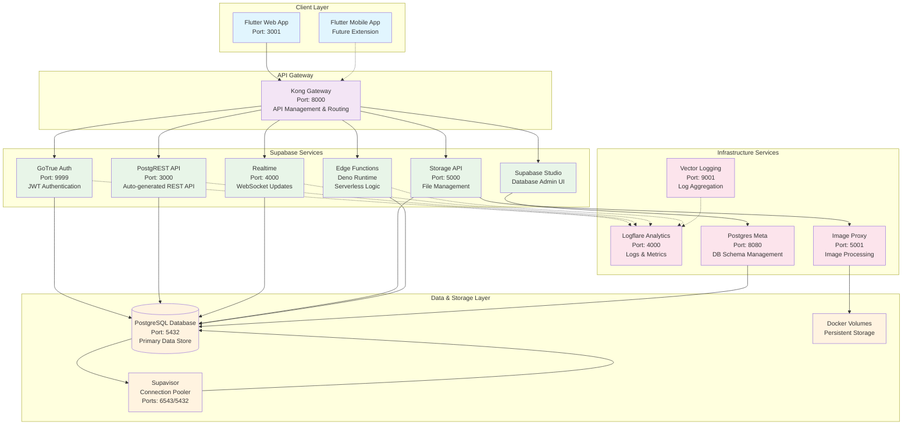
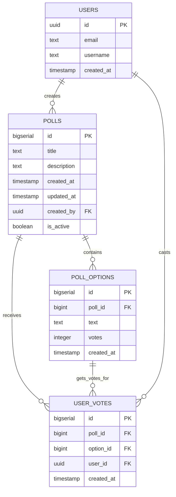

# Pollino 🗳️

> **Your comprehensive Poll App by your side**

[](https://flutter.dev)
[](https://supabase.com)
[](https://www.docker.com)
[](https://opensource.org/licenses/MIT)

Eine moderne, vollständig containerisierte Umfrage-Anwendung, entwickelt mit Flutter für das Frontend und Supabase als Backend-as-a-Service. Pollino ermöglicht es Benutzern, einfach Umfragen zu erstellen, zu verwalten und daran teilzunehmen.

## 🚀 Features

### Frontend (Flutter Web)
- **🎨 Responsive Design**: Optimiert für Desktop und Mobile
- **⚡ State Management**: BLoC Pattern mit flutter_bloc
- **💾 Offline Support**: Lokale Datenspeicherung mit Hive
- **🔄 Real-time Updates**: Live-Synchronisation mit Supabase
- **🧭 Navigation**: Routemaster für deklaratives Routing
- **📊 Interaktive Umfragen**: Echtzeit-Abstimmungen mit sofortigen Ergebnissen

### Backend (Supabase Stack)
- **🗄️ PostgreSQL Datenbank**: Relationale Datenbank mit RLS
- **🔐 Authentication**: Supabase Auth mit JWT
- **🌐 REST API**: PostgREST für automatische API-Generierung
- **⚡ Realtime**: WebSocket-basierte Live-Updates
- **📁 Storage**: Datei-Upload und -verwaltung
- **🔧 Edge Functions**: Serverless Deno-basierte Functions
- **📈 Analytics**: Integrierte Logflare Analytics

### DevOps & Infrastruktur
- **🐳 Docker**: Vollständig containerisiert
- **🚀 Multi-Stage Builds**: Optimierte Production Builds
- **🔄 Reverse Proxy**: Kong Gateway für API-Management
- **📊 Monitoring**: Health Checks und Logging
- **🔒 Security**: Nginx Security Headers

## 🏗️ Architektur



## 🗃️ Datenbankschema

Das folgende ER-Diagramm zeigt die Datenbankstruktur für das Pollino-System:



### Datenbankfelder im Detail:

**polls Tabelle:**
- `id`: Eindeutige Umfrage-ID (Auto-Increment)
- `title`: Titel der Umfrage
- `description`: Optionale Beschreibung
- `created_by`: Referenz zum Ersteller (User UUID)
- `is_active`: Status der Umfrage (aktiv/inaktiv)

**poll_options Tabelle:**
- `id`: Eindeutige Options-ID
- `poll_id`: Referenz zur Umfrage
- `text`: Text der Antwortoption
- `votes`: Anzahl der erhaltenen Stimmen

**user_votes Tabelle:**
- Verhindert Mehrfachabstimmungen pro User
- Verknüpft User mit gewählter Option
- Einzigartigkeits-Constraint auf `(poll_id, user_id)`

## 📋 Voraussetzungen

- **Docker** & **Docker Compose** (v2.0+)
- **Git** für Repository-Management
- **Flutter SDK** 3.27.1+ (für lokale Entwicklung)
- **Dart SDK** 3.6.0+

## 🔧 Installation & Setup

### 1. Repository klonen
```bash
git clone https://github.com/Ahmadre/Pollino.git
cd Pollino
```

### 2. Umgebungsvariablen konfigurieren
```bash
# .env Datei erstellen (Beispiel)
cp .env.example .env

# Wichtige Variablen anpassen:
# POSTGRES_PASSWORD=your_secure_password
# JWT_SECRET=your_jwt_secret
# SUPABASE_PUBLIC_URL=http://localhost:8000
```

### 3. Services starten
```bash
# Alle Services starten
docker compose up -d

# Nur spezifische Services
docker compose up -d db auth rest flutter-web

# Mit Entwicklungstools
docker compose -f docker-compose.yml -f ./dev/docker-compose.dev.yml up -d
```

### 4. Datenbank initialisieren
```bash
# Die Datenbank wird automatisch mit Beispieldaten initialisiert
# Schema: volumes/db/init/polls_schema.sql
```

## 🌐 Zugriff auf die Anwendung

| Service | URL | Beschreibung |
|---------|-----|--------------|
| **Flutter Web App** | http://localhost:3001 | Hauptanwendung |
| **Supabase Studio** | http://localhost:54323 | Datenbank-Admin |
| **API Gateway** | http://localhost:8000 | REST API Endpoint |
| **Analytics** | http://localhost:4000 | Logflare Dashboard |

## 🏃‍♂️ Entwicklung

### Flutter Web lokal entwickeln
```bash
cd frontend

# Dependencies installieren
flutter pub get

# Development Server starten
flutter run -d web-server --web-port 3000

# Build für Produktion
flutter build web --release --web-renderer canvaskit
```

### Datenbank-Migrationen
```bash
# Schema ändern
# 1. SQL in volumes/db/init/polls_schema.sql anpassen
# 2. Services neu starten
docker compose down
docker compose up -d
```

### Logs anzeigen
```bash
# Alle Services
docker compose logs -f

# Spezifischer Service
docker compose logs -f flutter-web
docker compose logs -f db
docker compose logs -f auth
```

## 🧪 Testing

### Flutter Tests
```bash
cd frontend
flutter test
```

### API Tests
```bash
# Health Checks
curl http://localhost:3001/health
curl http://localhost:8000/health

# API Endpoints testen
curl http://localhost:8000/rest/v1/polls
```

## 📦 Deployment

### Production Build
```bash
# Flutter Web optimiert bauen
docker compose build flutter-web

# Production Stack
docker compose -f docker-compose.yml -f docker-compose.prod.yml up -d
```

### Environment Konfiguration
```bash
# Produktive Umgebungsvariablen setzen
export SUPABASE_PUBLIC_URL=https://your-domain.com
export POSTGRES_PASSWORD=secure_production_password
export JWT_SECRET=your_production_jwt_secret
```

## 📁 Projektstruktur

```
Pollino/
├── 📱 frontend/              # Flutter Web Application
│   ├── lib/
│   │   ├── bloc/            # BLoC State Management
│   │   ├── screens/         # UI Screens
│   │   ├── services/        # API Services
│   │   └── main.dart        # App Entry Point
│   ├── Dockerfile           # Flutter Web Container
│   └── pubspec.yaml         # Flutter Dependencies
├── 🗄️ volumes/              # Persistent Data
│   ├── db/                 # Database Scripts & Data
│   ├── functions/          # Supabase Edge Functions
│   └── storage/            # File Storage
├── 🐳 docker-compose.yml    # Main Services Definition
├── 🔧 dev/                 # Development Tools
└── 📋 README.md            # This file
```

## 🤝 Beitragen

1. **Fork** das Repository
2. **Feature Branch** erstellen (`git checkout -b feature/amazing-feature`)
3. **Commit** deine Änderungen (`git commit -m 'Add amazing feature'`)
4. **Push** zum Branch (`git push origin feature/amazing-feature`)
5. **Pull Request** erstellen

## 🐛 Troubleshooting

### Häufige Probleme

**Docker Build Fehler:**
```bash
# Cache löschen und neu bauen
docker compose down
docker system prune -a
docker compose build --no-cache
docker compose up -d
```

**Datenbank-Verbindungsfehler:**
```bash
# Datenbank Status prüfen
docker compose ps
docker compose logs db

# Reset der Datenbank
./reset.sh
```

**Flutter Dependencies:**
```bash
cd frontend
flutter clean
flutter pub get
```

## 📄 Lizenz

Dieses Projekt ist unter der [MIT Lizenz](LICENSE) lizenziert.

## 👥 Team

- **Entwicklung**: [Ahmadre](https://github.com/Ahmadre)
- **Architektur**: Flutter + Supabase Stack
- **DevOps**: Docker + Kong + Nginx

## 📊 Tech Stack Übersicht

| Kategorie | Technologie | Version | Zweck |
|-----------|-------------|---------|-------|
| **Frontend** | Flutter | 3.27.1 | Web & Mobile UI |
| **Backend** | Supabase | 2.x | Backend-as-a-Service |
| **Datenbank** | PostgreSQL | 15.8 | Primary Data Store |
| **API Gateway** | Kong | 2.8.1 | Routing & Security |
| **Web Server** | Nginx | 1.25 | Static File Serving |
| **Analytics** | Logflare | 1.14.2 | Logging & Monitoring |
| **Container** | Docker | Latest | Containerization |
