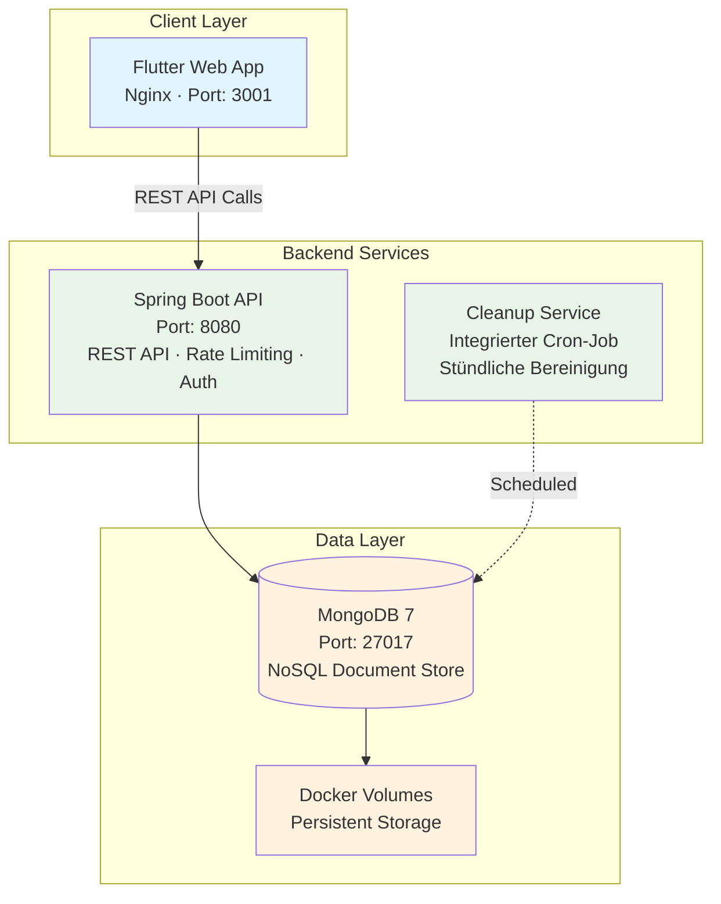

<div align="center">
  

# Pollino

> **Your comprehensive Poll App by your side**

</div>

[](https://github.com/Ahmadre/Pollino/actions/workflows/frontend-docker-build.yml)
[](https://github.com/Ahmadre/Pollino/actions/workflows/backend-docker-build.yml)
[](https://flutter.dev)
[](https://spring.io/projects/spring-boot)
[](https://www.mongodb.com)
[](https://www.docker.com)
[](https://opensource.org/licenses/MIT)

Eine moderne, vollständig containerisierte Umfrage-Anwendung, entwickelt mit Flutter für das Frontend und Spring Boot mit MongoDB als Backend. Pollino ermöglicht es Benutzern, einfach Umfragen zu erstellen, zu verwalten und daran teilzunehmen.

<div align="center">
  
</div>

> **📸 Visuelle Dokumentation**: Das Interface zeigt die hauptsächliche Umfrage-Funktionalität mit Echtzeit-Abstimmungen, Like- und Kommentar-System und responsivem Design.

## 🆕 Was ist neu in 2.0.0

- **Architektur-Migration**: Komplett neues Backend — von Supabase (PostgreSQL) auf Spring Boot 3.3 + MongoDB 7
- **Vereinfachte Infrastruktur**: Nur noch 3 Container (MongoDB, Backend, Frontend) statt 15+ Supabase-Services
- **Spring Boot REST API**: Eigene API mit Rate Limiting, API-Key-Auth und Actuator Health Checks
- **Integrierter Cleanup-Service**: Abgelaufene Umfragen werden direkt im Backend per Cron-Job bereinigt (kein separater Container mehr)
- **CI/CD für Backend**: Neuer GitHub Actions Workflow für automatischen Docker-Build bei Änderungen am Backend
- **Bugfixes**: TimePicker-Validierung, CRLF-Fixes für Docker-Builds auf Windows

## 🚀 Features

### Frontend (Flutter Web)

- **🎨 Responsive Design**: Optimiert für Desktop und Mobile
- **⚡ State Management**: BLoC Pattern mit flutter_bloc
- **💾 Offline Support**: Lokale Datenspeicherung mit Hive
- **🧭 Navigation**: Routemaster für deklaratives Routing
- **📊 Interaktive Umfragen**: Echtzeit-Abstimmungen mit sofortigen Ergebnissen
- **↕️ Drag & Drop Reihenfolge**: Antwortoptionen per Drag & Drop sortieren (persistente Reihenfolge)
- **💬 Kommentarsystem**: Benutzer können Kommentare zu Umfragen hinzufügen und bearbeiten
- **🔧 Admin-Panel**: Umfangreiche Administrationsfunktionen für Umfrage-Verwaltung
- **✏️ Poll-Bearbeitung**: Vollständige Bearbeitung bestehender Umfragen mit Admin-Token
- **🌍 Mehrsprachigkeit**: Unterstützung für 6 Sprachen (DE, EN, FR, ES, JA, AR)
- **🔒 Anonymitätslogik**: Anonyme Umfragen werden nicht gelistet (nur Direktlink), Tooltips zeigen Namen nur bei nicht-anonymen Stimmen
- **📄 PDF-Export**: Umfragen als PDF herunterladen

### Backend (Spring Boot + MongoDB)

- **☕ Spring Boot 3.3**: Java 21 basierte REST API
- **🍃 MongoDB 7**: NoSQL-Datenbank für flexible Datenstruktur
- **🔐 API-Key-Authentifizierung**: Sicherer Zugriff über API-Key-Filter
- **⚡ Rate Limiting**: Konfigurierbare Request-Limits (60/min allgemein, 10/min für Votes)
- **🔧 Admin-Funktionen**: Token-basierte Administratorrechte für Umfrage-Verwaltung
- **🧹 Automatischer Cleanup**: Integrierter Cron-Job für abgelaufene Umfragen
- **💚 Health Checks**: Spring Actuator für Health- und Info-Endpoints
- **🔄 CORS**: Konfigurierbare Cross-Origin Resource Sharing

### DevOps & Infrastruktur

- **🐳 Docker**: Vollständig containerisiert (3 Services)
- **🚀 Multi-Stage Builds**: Optimierte Production Builds für Backend und Frontend
- **🔄 CI/CD**: GitHub Actions für automatische Docker-Image-Builds
- **📊 Monitoring**: Health Checks für alle Services
- **🔒 Security**: Nginx Security Headers, API-Key-Auth, Rate Limiting

## 🏗️ Architektur


```mermaid
graph TB
    %% Client Layer
    subgraph "Client Layer"
        WEB[Flutter Web App<br/>Nginx · Port: 3001]
    end

    %% Backend Layer
    subgraph "Backend Services"
        API[Spring Boot API<br/>Port: 8080<br/>REST API · Rate Limiting · Auth]
        CLEANUP[Cleanup Service<br/>Integrierter Cron-Job<br/>Stündliche Bereinigung]
    end

    %% Data Layer
    subgraph "Data Layer"
        DB[(MongoDB 7<br/>Port: 27017<br/>NoSQL Document Store)]
        VOLUMES[Docker Volumes<br/>Persistent Storage]
    end

    %% Data Flow Connections
    WEB -->|REST API Calls| API
    API --> DB
    CLEANUP -.->|Scheduled| DB
    DB --> VOLUMES

    %% Styling
    classDef frontend fill:#e1f5fe
    classDef backend fill:#e8f5e8
    classDef database fill:#fff3e0

    class WEB frontend
    class API,CLEANUP backend
    class DB,VOLUMES database
```

## 📋 Voraussetzungen

- **Docker** & **Docker Compose** (v2.0+)
- **Git** für Repository-Management
- **Flutter SDK** 3.27.1+ (für lokale Entwicklung)
- **Dart SDK** 3.6.0+
- **Java 21** (für lokale Backend-Entwicklung)

## 🔧 Installation & Setup

### 1. Repository klonen

```bash
git clone https://github.com/Ahmadre/Pollino.git
cd Pollino
```

### 2. Umgebungsvariablen konfigurieren

```bash
# .env Datei erstellen (Beispiel)
cp .env.example .env

# Wichtige Variablen anpassen:
# MONGODB_USER=pollino
# MONGODB_PASSWORD=pollino_secret
# API_KEY=your-secure-api-key
# API_BASE_URL=http://localhost:8080
```

### 3. Services starten

```bash
# Alle Services starten (Images von Docker Hub)
docker compose up -d

# Oder lokal bauen
docker compose -f docker-compose.local.yml up -d --build
```

### 4. Upgrade von 1.x (Supabase) auf 2.0

Falls du von einer älteren Supabase-basierten Version kommst:

> ⚠️ **Breaking Change**: Die gesamte Backend-Architektur wurde migriert. Daten aus dem alten PostgreSQL/Supabase-Stack müssen manuell nach MongoDB überführt werden.

1. Alte Supabase-Container stoppen und entfernen:

```bash
docker compose down -v --remove-orphans
```

2. Neuen Stack starten:

```bash
docker compose up -d
```

3. Frontend neu generieren:

```bash
cd frontend
dart run build_runner build --delete-conflicting-outputs
```

## 🌐 Zugriff auf die Anwendung

| Service              | URL                                             | Beschreibung          |
| -------------------- | ----------------------------------------------- | --------------------- |
| **Flutter Web App**  | [http://localhost:3001](http://localhost:3001)   | Hauptanwendung        |
| **Backend API**      | [http://localhost:8080](http://localhost:8080)   | REST API              |
| **Health Check**     | [http://localhost:8080/actuator/health](http://localhost:8080/actuator/health) | Backend Status |

## 🏃‍♂️ Entwicklung

### Flutter Web lokal entwickeln

```bash
cd frontend

# Dependencies installieren
flutter pub get

# Code generieren (Freezed, JSON Serializable)
dart run build_runner build --delete-conflicting-outputs

# Development Server starten
flutter run -d web-server --web-port 3000

# Build für Produktion
flutter build web --release --web-renderer canvaskit
```

### Backend lokal entwickeln

```bash
cd backend

# Mit Maven Wrapper starten
./mvnw spring-boot:run

# Oder mit eigener Konfiguration
./mvnw spring-boot:run -Dspring-boot.run.arguments="--spring.data.mongodb.uri=mongodb://localhost:27017/pollino"
```

### Logs anzeigen

```bash
# Alle Services
docker compose logs -f

# Spezifischer Service
docker compose logs -f frontend
docker compose logs -f backend
docker compose logs -f mongodb
```

## 🧪 Testing

### Flutter Tests

```bash
cd frontend
flutter test
```

### API Tests

```bash
# Health Check
curl http://localhost:8080/actuator/health

# Polls abfragen
curl http://localhost:8080/api/polls

# Einzelne Umfrage
curl http://localhost:8080/api/polls/{id}
```

## 📦 Deployment

### Production Stack

```bash
# Production mit Docker Hub Images
docker compose up -d

# Oder lokal bauen
docker compose -f docker-compose.local.yml up -d --build
```

### Environment Konfiguration

| Variable                | Default                      | Beschreibung                  |
| ----------------------- | ---------------------------- | ----------------------------- |
| `MONGODB_USER`          | `pollino`                    | MongoDB Benutzername          |
| `MONGODB_PASSWORD`      | `pollino_secret`             | MongoDB Passwort              |
| `MONGODB_DATABASE`      | `pollino`                    | MongoDB Datenbankname         |
| `API_KEY`               | `changeme-generate-...`      | API-Key für Backend-Auth      |
| `CORS_ALLOWED_ORIGINS`  | `*`                          | Erlaubte CORS Origins         |
| `CLEANUP_ENABLED`       | `true`                       | Automatischer Cleanup aktiv   |
| `CLEANUP_CRON`          | `0 0 * * * *`                | Cleanup Cron-Ausdruck         |
| `RATE_LIMIT_RPM`        | `60`                         | Allgemeines Rate Limit/min    |
| `RATE_LIMIT_VOTE_RPM`   | `10`                         | Vote Rate Limit/min           |
| `API_BASE_URL`          | `http://localhost:8080`      | Backend URL für Frontend      |
| `WEB_APP_URL`           | `http://localhost:3001`      | Frontend URL                  |

## 📁 Projektstruktur

```text
Pollino/
├── 📱 frontend/                    # Flutter Web Application
│   ├── lib/
│   │   ├── bloc/                  # BLoC State Management
│   │   ├── core/                  # Core Architecture
│   │   │   ├── error/             # Error Handling
│   │   │   ├── localization/      # I18n Service & Language Support
│   │   │   ├── network/           # Network Utilities
│   │   │   ├── usecase/           # Use Case Abstractions
│   │   │   └── utils/             # Timezone & Helper Functions
│   │   ├── features/              # Feature-based Architecture
│   │   │   └── polls/             # Poll Feature Module
│   │   │       ├── data/          # Data Layer (Models, DataSources, Repositories)
│   │   │       └── domain/        # Domain Layer (Entities, UseCases, Interfaces)
│   │   ├── screens/               # UI Screens (Home, Poll Detail, Admin)
│   │   ├── services/              # API, Comments, Like, PDF Services
│   │   └── widgets/               # Reusable UI Components (PollForm, etc.)
│   ├── assets/                    # Static Assets & Translations (6 Languages)
│   ├── web/                       # Web-specific Files & PWA Configuration
│   └── test/                      # Unit & Widget Tests
├── ☕ backend/                     # Spring Boot Backend
│   ├── src/main/java/com/pollino/
│   │   ├── config/                # Security, CORS, Rate Limiting, MongoDB Config
│   │   ├── controller/            # REST Controllers (Poll, Comment)
│   │   ├── dto/                   # Request/Response DTOs
│   │   ├── exception/             # Global Exception Handling
│   │   ├── model/                 # Domain Models (Poll, Vote, Comment)
│   │   ├── repository/            # MongoDB Repositories
│   │   └── service/               # Business Logic & Cleanup Service
│   ├── src/main/resources/        # Application Configuration
│   ├── Dockerfile                 # Multi-stage Build (JDK → JRE)
│   └── pom.xml                    # Maven Dependencies
├── 🔧 dev/                        # Development Tools
│   ├── docker-compose.dev.yml     # Development Override
│   └── data.sql                   # Development Sample Data
├── 🐳 docker-compose.yml          # Production Stack (Docker Hub Images)
├── 🐳 docker-compose.local.yml    # Local Development Build
├── 📋 README.md                   # This Documentation
├── 📝 CHANGELOG.md                # Version History & Changes
└── 📄 LICENSE                     # MIT License
```

## 🔌 API-Übersicht

### Polls (`/api/polls`)

| Methode  | Pfad                                | Beschreibung                    |
| -------- | ----------------------------------- | ------------------------------- |
| `GET`    | `/api/polls?page=&limit=`           | Paginierte Liste öffentlicher Umfragen |
| `GET`    | `/api/polls/{id}`                   | Einzelne Umfrage abrufen        |
| `POST`   | `/api/polls`                        | Umfrage erstellen               |
| `PUT`    | `/api/polls/{id}`                   | Umfrage bearbeiten (Admin-Token)|
| `DELETE` | `/api/polls/{id}?adminToken=`       | Umfrage löschen (Admin-Token)   |
| `POST`   | `/api/polls/{id}/vote`              | Abstimmen                       |
| `GET`    | `/api/polls/{id}/votes`             | Alle Stimmen abrufen            |
| `POST`   | `/api/polls/{id}/like`              | Like umschalten                 |
| `POST`   | `/api/polls/{id}/validate-token`    | Admin-Token validieren          |

### Kommentare (`/api/comments`)

| Methode  | Pfad                                      | Beschreibung              |
| -------- | ----------------------------------------- | ------------------------- |
| `GET`    | `/api/comments/{pollId}`                  | Kommentare abrufen        |
| `GET`    | `/api/comments/{pollId}/count`            | Kommentar-Anzahl          |
| `POST`   | `/api/comments/{pollId}`                  | Kommentar hinzufügen      |
| `PUT`    | `/api/comments/{pollId}/{commentId}`      | Kommentar bearbeiten      |
| `DELETE` | `/api/comments/{pollId}/{commentId}`      | Kommentar löschen         |

## 🤝 Beitragen

1. **Fork** das Repository
2. **Feature Branch** erstellen (`git checkout -b feature/amazing-feature`)
3. **Commit** deine Änderungen (`git commit -m 'Add amazing feature'`)
4. **Push** zum Branch (`git push origin feature/amazing-feature`)
5. **Pull Request** erstellen

## 🐛 Troubleshooting

### Häufige Probleme

**Docker Build Fehler:**

```bash
# Cache löschen und neu bauen
docker compose down
docker system prune -a
docker compose -f docker-compose.local.yml build --no-cache
docker compose -f docker-compose.local.yml up -d
```

**MongoDB Verbindungsfehler:**

```bash
# Datenbank Status prüfen
docker compose ps
docker compose logs mongodb

# Reset der Datenbank
docker compose down -v
docker compose up -d
```

**Flutter Dependencies:**

```bash
cd frontend
flutter clean
flutter pub get
dart run build_runner build --delete-conflicting-outputs
```

**Windows CRLF-Probleme (Docker Build):**

Die Dockerfiles enthalten automatische CRLF→LF-Konvertierung für Shell-Skripte. Falls dennoch Probleme auftreten:

```bash
# Git Konfiguration anpassen
git config core.autocrlf input
```

## 📄 Lizenz

Dieses Projekt ist unter der [MIT Lizenz](LICENSE) lizenziert.

## 👥 Team

- **Entwicklung**: [Ahmadre](https://github.com/Ahmadre)
- **Architektur**: Flutter + Spring Boot + MongoDB
- **DevOps**: Docker + GitHub Actions + Nginx

## 📊 Tech Stack Übersicht

| Kategorie         | Technologie   | Version | Zweck                     |
| ----------------- | ------------- | ------- | ------------------------- |
| **Frontend**      | Flutter       | 3.27.1  | Web UI                    |
| **Backend**       | Spring Boot   | 3.3     | REST API                  |
| **Runtime**       | Java          | 21      | Backend Runtime           |
| **Datenbank**     | MongoDB       | 7       | NoSQL Document Store      |
| **Web Server**    | Nginx         | stable  | Static File Serving       |
| **Container**     | Docker        | Latest  | Containerization          |
| **CI/CD**         | GitHub Actions| -       | Automated Builds          |

