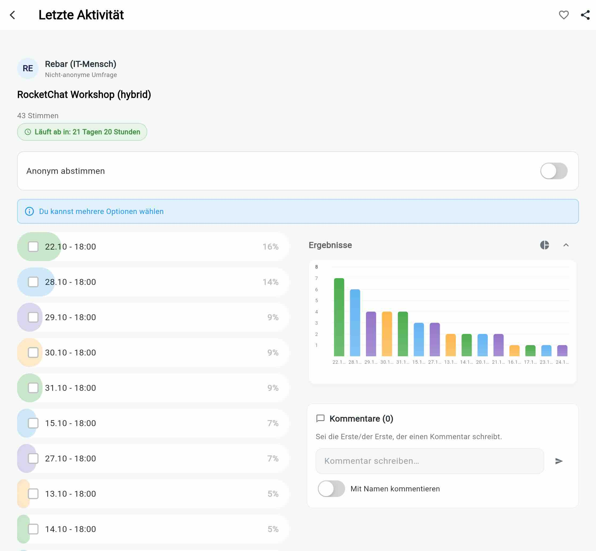
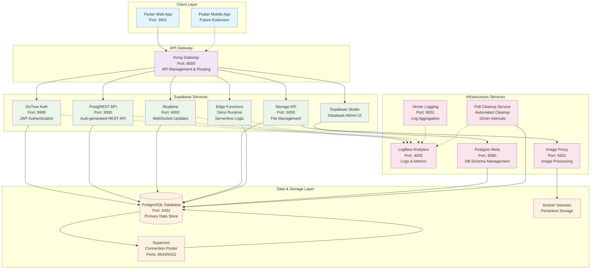

<div align="center">
  

# Pollino

> **Your comprehensive Poll App by your side**

</div>

[](https://github.com/Ahmadre/Pollino/actions/workflows/frontend-docker-build.yml)
[](https://flutter.dev)
[](https://supabase.com)
[](https://www.docker.com)
[](https://opensource.org/licenses/MIT)

Eine moderne, vollständig containerisierte Umfrage-Anwendung, entwickelt mit Flutter für das Frontend und Supabase als Backend-as-a-Service. Pollino ermöglicht es Benutzern, einfach Umfragen zu erstellen, zu verwalten und daran teilzunehmen.

<div align="center">
  
</div>

> **📸 Visuelle Dokumentation**: Das Interface zeigt die hauptsächliche Umfrage-Funktionalität mit Echtzeit-Abstimmungen, Like- und Kommentar-System und responsivem Design.

## 🚀 Features

### Frontend (Flutter Web)

- **🎨 Responsive Design**: Optimiert für Desktop und Mobile
- **⚡ State Management**: BLoC Pattern mit flutter_bloc
- **💾 Offline Support**: Lokale Datenspeicherung mit Hive
- **🔄 Real-time Updates**: Live-Synchronisation mit Supabase
- **🧭 Navigation**: Routemaster für deklaratives Routing
- **📊 Interaktive Umfragen**: Echtzeit-Abstimmungen mit sofortigen Ergebnissen
- **💬 Kommentarsystem**: Benutzer können Kommentare zu Umfragen hinzufügen und bearbeiten
- **🔧 Admin-Panel**: Umfangreiche Administrationsfunktionen für Umfrage-Verwaltung
- **✏️ Poll-Bearbeitung**: Vollständige Bearbeitung bestehender Umfragen mit Admin-Token
- **🌍 Mehrsprachigkeit**: Unterstützung für 6 Sprachen (DE, EN, FR, ES, JA, AR)

### Backend (Supabase Stack)

- **🗄️ PostgreSQL Datenbank**: Relationale Datenbank mit RLS
- **🔐 Authentication**: Supabase Auth mit JWT
- **🌐 REST API**: PostgREST für automatische API-Generierung
- **⚡ Realtime**: WebSocket-basierte Live-Updates
- **📁 Storage**: Datei-Upload und -verwaltung
- **🔧 Edge Functions**: Serverless Deno-basierte Functions
- **📈 Analytics**: Integrierte Logflare Analytics
- **🔐 Admin-Funktionen**: Token-basierte Administratorrechte
- **🔄 Sequenz-Management**: Automatische Datenbank-Sequenz-Synchronisation

### DevOps & Infrastruktur

- **🐳 Docker**: Vollständig containerisiert
- **🚀 Multi-Stage Builds**: Optimierte Production Builds
- **🔄 Reverse Proxy**: Kong Gateway für API-Management
- **📊 Monitoring**: Health Checks und Logging
- **🔒 Security**: Nginx Security Headers

## 🏗️ Architektur



## 📋 Voraussetzungen

- **Docker** & **Docker Compose** (v2.0+)
- **Git** für Repository-Management
- **Flutter SDK** 3.27.1+ (für lokale Entwicklung)
- **Dart SDK** 3.6.0+

## 🔧 Installation & Setup

### 1. Repository klonen

```bash
git clone https://github.com/Ahmadre/Pollino.git
cd Pollino
```

### 2. Umgebungsvariablen konfigurieren

```bash
# .env Datei erstellen (Beispiel)
cp .env.example .env

# Wichtige Variablen anpassen:
# POSTGRES_PASSWORD=your_secure_password
# JWT_SECRET=your_jwt_secret
# SUPABASE_PUBLIC_URL=http://localhost:8000
```

### 3. Services starten

```bash
# Alle Services starten
docker compose up -d

# Nur spezifische Services
docker compose up -d db auth rest flutter-web

# Mit Entwicklungstools
docker compose -f docker-compose.yml -f ./dev/docker-compose.dev.yml up -d
```

### 4. Datenbank initialisieren

```bash
# Die Datenbank wird automatisch mit Beispieldaten initialisiert
# Schema: volumes/db/init/polls_schema.sql
```

## 🌐 Zugriff auf die Anwendung

| Service                   | URL                    | Beschreibung       |
| ------------------------- | ---------------------- | ------------------ |
| **Flutter Web App** | http://localhost:3001  | Hauptanwendung     |
| **Supabase Studio** | http://localhost:54323 | Datenbank-Admin    |
| **API Gateway**     | http://localhost:8000  | REST API Endpoint  |
| **Analytics**       | http://localhost:4000  | Logflare Dashboard |

## 🏃‍♂️ Entwicklung

### Flutter Web lokal entwickeln

```bash
cd frontend

# Dependencies installieren
flutter pub get

# Development Server starten
flutter run -d web-server --web-port 3000

# Build für Produktion
flutter build web --release --web-renderer canvaskit
```

### Datenbank-Migrationen

```bash
# Schema ändern
# 1. SQL in volumes/db/init/polls_schema.sql anpassen
# 2. Services neu starten
docker compose down
docker compose up -d
```

### Logs anzeigen

```bash
# Alle Services
docker compose logs -f

# Spezifischer Service
docker compose logs -f flutter-web
docker compose logs -f db
docker compose logs -f auth
```

## 🧪 Testing

### Flutter Tests

```bash
cd frontend
flutter test
```

### API Tests

```bash
# Health Checks
curl http://localhost:3001/health
curl http://localhost:8000/health

# API Endpoints testen
curl http://localhost:8000/rest/v1/polls
```

## 📦 Deployment

### Entwicklungsumgebung

```bash
# Flutter Web optimiert bauen
docker compose build flutter-web

# Production Stack
docker compose -f docker-compose.yml -f docker-compose.prod.yml up -d
```

### Environment Konfiguration

```bash
# Produktive Umgebungsvariablen setzen
export SUPABASE_PUBLIC_URL=https://your-domain.com
export POSTGRES_PASSWORD=secure_production_password
export JWT_SECRET=your_production_jwt_secret
```

## 📁 Projektstruktur

```text
Pollino/
├── 📱 frontend/                    # Flutter Web Application
│   ├── lib/
│   │   ├── bloc/                  # BLoC State Management
│   │   ├── core/                  # Core Architecture
│   │   │   ├── error/             # Error Handling
│   │   │   ├── localization/      # I18n Service & Language Support
│   │   │   ├── network/           # Network Utilities
│   │   │   ├── usecase/           # Use Case Abstractions
│   │   │   └── utils/             # Timezone & Helper Functions
│   │   ├── features/              # Feature-based Architecture
│   │   │   └── polls/             # Poll Feature Module
│   │   │       ├── data/          # Data Layer (Models, DataSources, Repositories)
│   │   │       └── domain/        # Domain Layer (Entities, UseCases, Interfaces)
│   │   ├── screens/               # UI Screens (Home, Poll Detail, Create, Edit, Admin)
│   │   ├── services/              # Application Services (Supabase, Like System)
│   │   └── widgets/               # Reusable UI Components (PollForm, etc.)
│   ├── assets/                    # Static Assets & Translations (6 Languages)
│   ├── web/                       # Web-specific Files & PWA Configuration
│   ├── test/                      # Unit & Widget Tests
│   └── build/                     # Flutter Build Output
├── 🗄️ volumes/                    # Persistent Data & Configuration
│   ├── db/                        # Database Configuration
│   │   ├── init/                  # Database Initialization Scripts
│   │   ├── migrations/            # Database Schema Migrations (7+ Files)
│   │   └── data/                  # PostgreSQL Data Directory
│   ├── functions/                 # Supabase Edge Functions
│   ├── api/                       # API Gateway Configuration
│   ├── logs/                      # Logging Configuration
│   ├── pooler/                    # Connection Pooling
│   └── storage/                   # File Storage
├── 🧹 poll-cleanup/               # Automated Poll Cleanup Service
│   ├── cleanup-script.sh          # Cleanup Logic Script
│   ├── start.sh                   # Service Startup Script
│   └── Dockerfile                 # Cleanup Service Container
├── 🔧 dev/                        # Development Tools
│   ├── docker-compose.dev.yml     # Development Override
│   └── data.sql                   # Development Sample Data
├── 🐳 docker-compose.s3.yml       # S3 Storage Extension
├── 🐳 docker-compose.yml          # Main Services Definition
├── 🔄 reset.sh                    # Database Reset Script
├── 📋 README.md                   # This Documentation
├── 📝 CHANGELOG.md                # Version History & Changes
├── 🔧 .env.example                # Environment Variables Template
├── 🔧 .env.prod                   # Production Environment Configuration
└── 📊 .vscode/                    # VS Code Configuration
    └── launch.json                # Debug Configuration
```

## 🤝 Beitragen

1. **Fork** das Repository
2. **Feature Branch** erstellen (`git checkout -b feature/amazing-feature`)
3. **Commit** deine Änderungen (`git commit -m 'Add amazing feature'`)
4. **Push** zum Branch (`git push origin feature/amazing-feature`)
5. **Pull Request** erstellen

## 🐛 Troubleshooting

### Häufige Probleme

**Docker Build Fehler:**

```bash
# Cache löschen und neu bauen
docker compose down
docker system prune -a
docker compose build --no-cache
docker compose up -d
```

**Datenbank-Verbindungsfehler:**

```bash
# Datenbank Status prüfen
docker compose ps
docker compose logs db

# Reset der Datenbank
./reset.sh
```

**Flutter Dependencies:**

```bash
cd frontend
flutter clean
flutter pub get
```

## �📄 Lizenz

Dieses Projekt ist unter der [MIT Lizenz](LICENSE) lizenziert.

## 👥 Team

- **Entwicklung**: [Ahmadre](https://github.com/Ahmadre)
- **Architektur**: Flutter + Supabase Stack
- **DevOps**: Docker + Kong + Nginx

## 📊 Tech Stack Übersicht

| Kategorie             | Technologie | Version | Zweck                |
| --------------------- | ----------- | ------- | -------------------- |
| **Frontend**    | Flutter     | 3.27.1  | Web & Mobile UI      |
| **Backend**     | Supabase    | 2.x     | Backend-as-a-Service |
| **Datenbank**   | PostgreSQL  | 15.8    | Primary Data Store   |
| **API Gateway** | Kong        | 2.8.1   | Routing & Security   |
| **Web Server**  | Nginx       | 1.25    | Static File Serving  |
| **Analytics**   | Logflare    | 1.14.2  | Logging & Monitoring |
| **Container**   | Docker      | Latest  | Containerization     |
